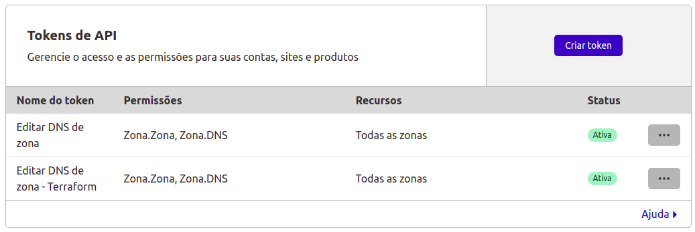

# IAC-MODULO-CLOUDFLARE

Modulo terraform para criar um registro dns em um site(zona) na [cloudflare.com](cloudflare.com).

## Requerimentos

### [API-TOKEN](https://dash.cloudflare.com/profile/api-tokens)

#### Privilégios para o token

* Recurso: Todas as zonas
  * Zona.Zona = editar
  * Zona.DNS = editar



### Site(Zona)

Para testar o modulo é necessário ter uma zona criada.
Está como _TODO_ do projeto, o modulo cirar a zona para teste, porém a ação de criar a zona com terraform mesmo está retornando com erro.

### [Variaveis de ambiente](https://registry.terraform.io/providers/cloudflare/cloudflare/latest/docs#argument-reference)

Para utilizar o modulo é necessário ter o token setado no ambiente.
Pode-se utilizar a variaivel de ambiente CLOUDFLARE_API_TOKEN ou CLOUDFLARE_EMAIL + CLOUDFLARE_API_KEY

* CLOUDFLARE_API_TOKEN = [API-TOKEN](https://dash.cloudflare.com/profile/api-tokens)

Referência [registry.terraform.io/providers/cloudflare](https://registry.terraform.io/providers/cloudflare/cloudflare/latest/docs)

## Como utilizar o modulo

```hcl
module "cloudflare_record_example" {
  source  = "git@github.com:mentoriaiac/iac-modulo-cloudflare.git?ref=v0.1"
  zone_id = var.cloudflare_zone_id
  name    = "example"
  value   = "192.168.1.1"
  type    = "A"
}
```

Outros exemplos no [main.tf](test/main.tf) do diretório de test.

## Variaveis

| Variable | Type                                                                                                                                                                    | Default |  Mandatory | Comment                                                                                                                                  |
|----------|-------------------------------------------------------------------------------------------------------------------------------------------------------------------------|---------|------------|------------------------------------------------------------------------------------------------------------------------------------------|
| zone_id  | string                                                                                                                                                                  |         | [x]        | Zone id for record.                                                                                                                      |
| name     | string                                                                                                                                                                  |         | [x]        | The name of the record.                                                                                                                  |
| value    | string                                                                                                                                                                  | null    |            | The (string) value of the record. Either this or data must be specified.                                                                 |
| type     | string                                                                                                                                                                  | A       |            | The type of the record.                                                                                                                  |
| ttl      | number                                                                                                                                                                  | 300     |            | The TTL of the record (default: '300').                                                                                                  |
| proxied  | bool                                                                                                                                                                    | false   |            | Whether the record gets Cloudflare's origin protection; defaults to false.                                                               |
| data     | object({     service  = string     proto    = string     name     = string     priority = number     weight   = number     port     = number     target   = string   }) | null    |            | Map of attributes that constitute the record value. Primarily used for LOC and SRV record types. Either this or value must be specified. |
| priority | number                                                                                                                                                                  | null    |            | The priority of the record.                                                                                                              |
|          |                                                                                                                                                                         |         |            |                                                                                                                                          |
|          |                                                                                                                                                                         |         |            |                                                                                                                                          |

## Teste do modulo

### Depencias para execução do teste

* Terraform 0.14
* TFsec
* Make

### Variaveis para executar o teste do modulo

* CLOUDFLARE_ZONE_NAME
* CLOUDFLARE_API_TOKEN

O CLOUDFLARE_ZONE_NAME é necessário porque ele será usado para criar os registros na cloudflare.
Exemplo de CLOUDFLARE_ZONE_NAME = *example.com*

### execução do teste

```sh
make test
```

## TODO

### Casos de teste

É necessário implementar novos testes com outros tipos de record que não implementados ainda.
O objetivo é validar a implementação e exemplificar a criação dos outros tipos de registros.

### CI

É necessário criar a implementação de CI para testes automatizados.

### Erro ao criar zona de dependencia do modulo

Para realizar o teste do modulo, é interessante o teste criar as suas dependencias, porém ocorre este erro ao criar a zona para realizar o test do modulo.

```hcl
resource "cloudflare_zone" "zone" {
    zone = "afonsorodrigues.info"
}
```

```sh
cloudflare_zone.zone: Creating...

Error: Error finding Zone "12aeb07229bf902dcab6539e735fd833": HTTP status 403: Invalid zone identifier (9109)

  on main.tf line 10, in resource "cloudflare_zone" "zone":
  10: resource "cloudflare_zone" "zone" {
```

Como uma analise superficial a api do terraform está tentando consultar o id logo após enviar a requisição de criação da zona.

É necessário investigar a implementação do provider e abrir uma issue para resolução do problema.

## Links

* [Terraform provider Cloudflare](https://registry.terraform.io/providers/cloudflare/cloudflare/latest/docs)
* [Resource cloudflare_record](https://registry.terraform.io/providers/cloudflare/cloudflare/latest/docs/resources/record)
